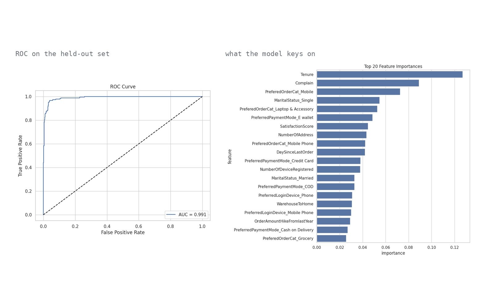

# E-commerce churn prediction

Binary churn classification on e-commerce customer records, with exploratory analysis
driving feature selection and gradient boosting for the model.

Artificial Intelligence for Marketing and Customer Analytics, BSc in Artificial
Intelligence — University of Pavia, University of Milano-Bicocca, University of Milan.



*Left: ROC on the held-out set. Right: the twenty highest-ranked features.*

## Task

5,630 customer records with 20 attributes covering tenure, order history, payment and
login preferences, satisfaction score, complaints, and delivery distance. Target:
whether the customer churned.

## Method

**Exploratory analysis.** Missingness inspected with `missingno`, univariate
distributions and boxplots per feature, bivariate analysis of each feature against the
target, churn rate by category, and a correlation matrix. Six features were dropped as
uninformative or redundant: gender, order count, cashback amount, coupons used, city
tier and hours spent on the app.

**Preprocessing.** Median imputation for numerical features, mode imputation for
categorical ones, one-hot encoding for the remaining categoricals.

**Model.** XGBoost tuned by grid search over 32 configurations with 3-fold
cross-validation on ROC AUC. Selected configuration: 200 estimators, maximum depth 5,
learning rate 0.1, subsample 0.8.

## Results

| Metric | Value |
|---|---|
| ROC AUC | 0.991 |
| Accuracy | 0.965 |
| Recall | 0.853 |
| Precision | 0.936 |

Feature importance ranks tenure first, followed by whether the customer had filed a
complaint. Both are consistent with the bivariate analysis, where they separate the
classes clearly. Preferred order category, marital status and payment method follow.

ROC AUC is reported alongside accuracy because the classes are imbalanced: unlike
accuracy, it is not inflated by predicting the majority class.

## Limitations

Imputation is performed on the full dataset before the train/test split, so test-set
statistics influence the imputed values in training. The effect is small for median and
mode, but the correct structure is to fit the imputers inside a pipeline. A future
revision would move preprocessing into a `ColumnTransformer` fitted per fold.

Class imbalance is not explicitly addressed through resampling or class weights; the
model handles it adequately here, but recall on the churned class (0.853) is the metric
that would benefit most from doing so.

## Repository

```
churn_model.ipynb    EDA, preprocessing, grid search, evaluation
figures/                       ROC curve, feature importance
```
